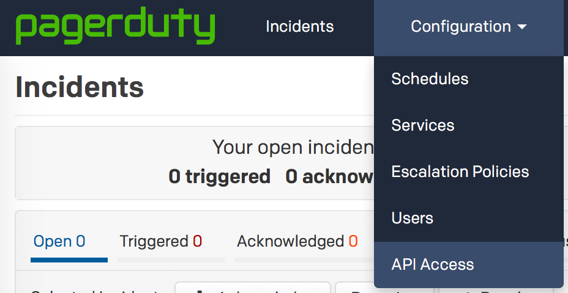
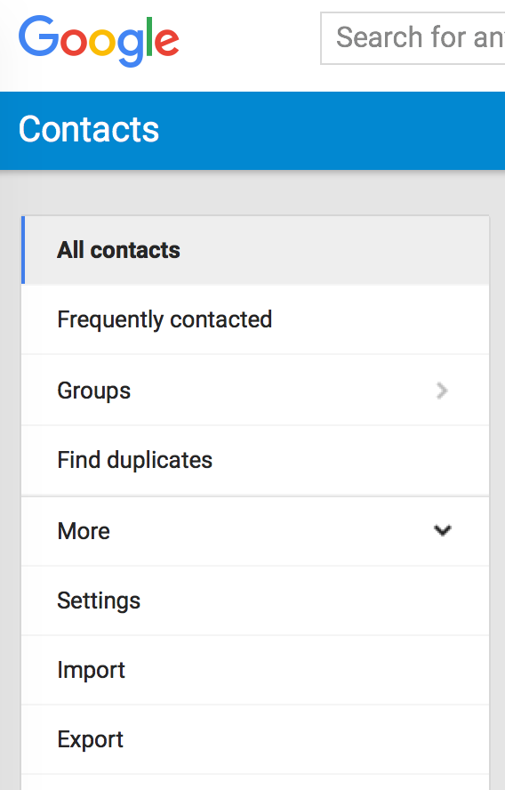
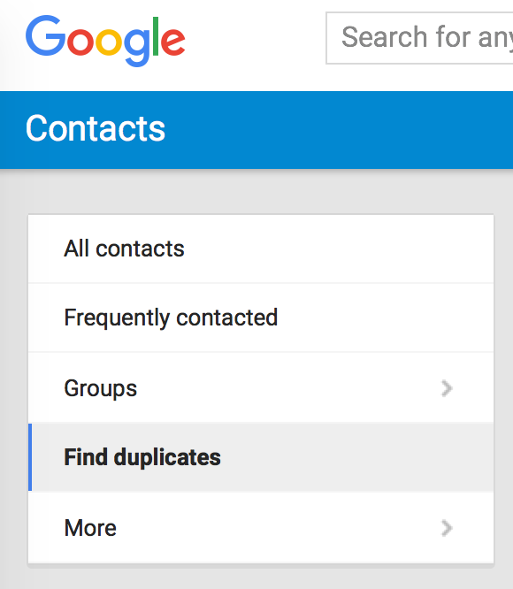

# Call me Maybe

Numbers of your colleagues from PagerDuty.

## Installation

The script is written in Python 3. I was lazy to support legacy languages.
I was also lazy to package the script and upload to PyPI, so installing from
source is your only option at the moment.

```shell
$ git clone git@github.com:honzajavorek/call-me-maybe.git ./call-me-maybe
$ cd ./call-me-maybe
$ python3 -m venv env
$ ./env/bin/activate
(env)$ pip install -r requirements.txt
```

## Usage

Get your API key:



Export the API key as `PAGER_DUTY_API_ACCESS_KEY` environment variable and
run the script.

```shell
(env)$ PAGER_DUTY_API_ACCESS_KEY=... python main.py
(env)$ cat contacts.csv
```

Results will be available in `contacts.csv` file. Upload this file to your
[Google Contacts](https://contacts.google.com/):



Then you'll want to merge contacts as you probably already had some of your
colleagues in your contacts and there will be some duplicates now.



Done!
